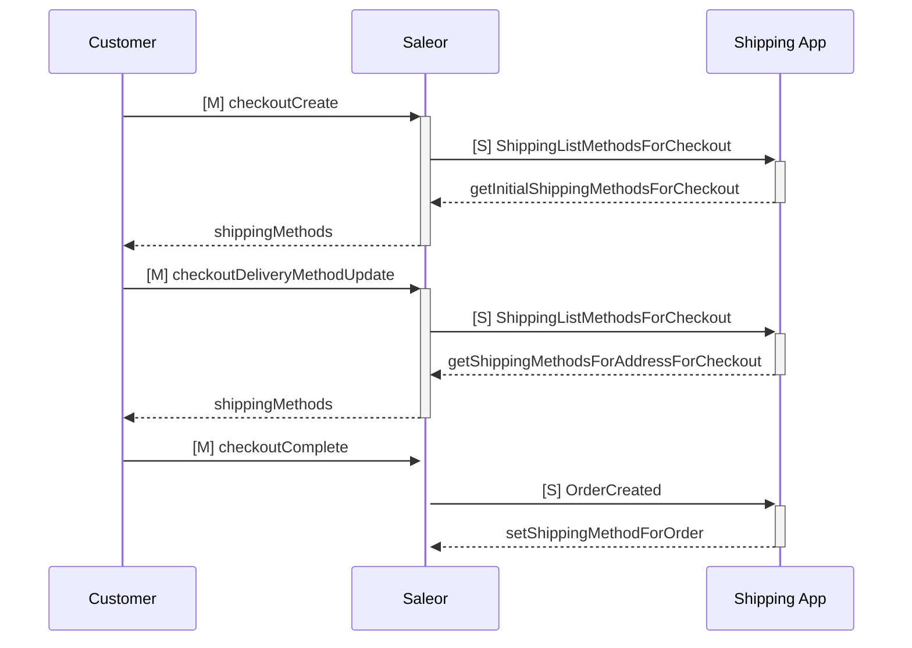

<div align="center">

</div>

<div align="center">
  <h1>Dummy Shipping App</h1>
</div>

<div align="center">
  <p>Example app that connects to third-party Shipping API and works with Saleor.</p>
</div>

<div align="center">
  <a href="https://saleor.io/">Website</a>
  <span> | </span>
  <a href="https://docs.saleor.io/docs/3.x/developer/checkout/address">Docs</a>
</div>

## Introduction

This app is an example of how to integrate with the Saleor shipping API. The diagram below illustrates the flow of requests (S represents subscription, M represents mutation):



### ShippingListMethodsForCheckout

You can use the third-party API to request shipping methods for a given checkout session. Since a checkout can be created with or without a shipping address, you may need additional logic for these two scenarios. For more information, refer to the [documentation](https://docs.saleor.io/docs/3.x/api-reference/checkout/objects/shipping-list-methods-for-checkout).

### OrderCreated

Used to tell third-party API that checkout session is completed and order with shipping method is created. [Docs](https://docs.saleor.io/docs/3.x/api-reference/orders/objects/order-created)

## Development

### Requirements

Before you start, make sure you have installed:

- [Node.js](https://nodejs.org/en/)
- [pnpm](https://pnpm.io/)
- [Saleor CLI](https://docs.saleor.io/docs/3.x/cli) - optional, but recommended
- [Bruno](https://www.usebruno.com/) - for API calls

### With CLI

The easiest way to set up a Saleor app is by using the Saleor CLI.

[Saleor CLI](https://github.com/saleor/saleor-cli) is designed to save you from the repetitive chores around Saleor development, including creating Apps. It will take the burden of spawning new apps locally, connecting them with Saleor environments, and establishing a tunnel for local development in seconds.

[Full Saleor CLI reference](https://docs.saleor.io/docs/3.x/cli)

If you don't have a (free developer) Saleor Cloud account, create one with the following command:

```
saleor register
```

You will also have to login with:

```
saleor login
```

Now you're ready to create your first App:

```
saleor app template [your-app-name]
```

In this step, Saleor CLI will:

- clone this repository to the specified folder
- install dependencies
- ask you whether you'd like to install the app in the selected Saleor environment
- create `.env` file
- start the app in development mode

Having your app ready, the final thing you want to establish is a tunnel with your Saleor environment. Go to your app's directory first and run:

```
saleor app tunnel
```

Your local application should be available now to the outside world (Saleor instance) for accepting all the events via webhooks.

A quick note: the next time you come back to your project, it is enough to launch your app in a standard way (and then launch your tunnel as described earlier):

```
pnpm dev
```

### Without CLI

1. Install the dependencies by running:

```
pnpm install
```

2. Start the local server with:

```
pnpm dev
```

3. Expose local environment using tunnel:
   Use tunneling tools like [localtunnel](https://github.com/localtunnel/localtunnel) or [ngrok](https://ngrok.com/).

4. Install the application in your dashboard:

If you use Saleor Cloud or your local server is exposed, you can install your app by following this link:

```
[YOUR_SALEOR_DASHBOARD_URL]/apps/install?manifestUrl=[YOUR_APP_TUNNEL_MANIFEST_URL]
```

This template host manifest at `/api/manifest`

You can also install application using GQL or command line. Follow the guide [how to install your app](https://docs.saleor.io/docs/3.x/developer/extending/apps/installing-apps#installation-using-graphql-api) to learn more.

### Generated schema and typings

Commands `build` and `dev` would generate schema and typed functions using Saleor's GraphQL endpoint. Commit the `generated` folder to your repo as they are necessary for queries and keeping track of the schema changes.

[Learn more](https://www.graphql-code-generator.com/) about GraphQL code generation.

### Storing registration data - APL

During the registration process, Saleor API passes the auth token to the app. With this token App can query Saleor API with privileged access (depending on requested permissions during the installation).
To store this data, app-template use a different [APL interfaces](https://github.com/saleor/saleor-app-sdk/blob/main/docs/apl.md).

The choice of the APL is made using the `APL` environment variable. If the value is not set, FileAPL is used. Available choices:

- `file`: no additional setup is required. Good choice for local development. It can't be used for multi tenant-apps or be deployed (not intended for production)
- `upstash`: use [Upstash](https://upstash.com/) Redis as storage method. Free account required. It can be used for development and production and supports multi-tenancy. Requires `UPSTASH_URL` and `UPSTASH_TOKEN` environment variables to be set

If you want to use your own database, you can implement your own APL. [Check the documentation to read more.](https://github.com/saleor/saleor-app-sdk/blob/main/docs/apl.md)

### Running Bruno

If you have your application up and running inside Saleor Dashboard now its time to run GraphQL mutations. To get started you need:

1. Create `.env` inside `bruno` folder based on `.env.example`
2. Fill the needed env variables
3. Open Bruno and send request in sequence they are defined to make full checkout flow
